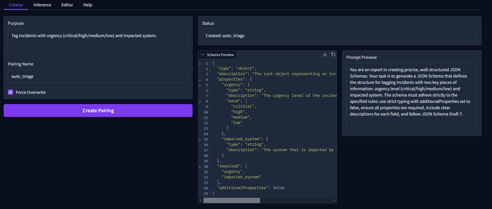
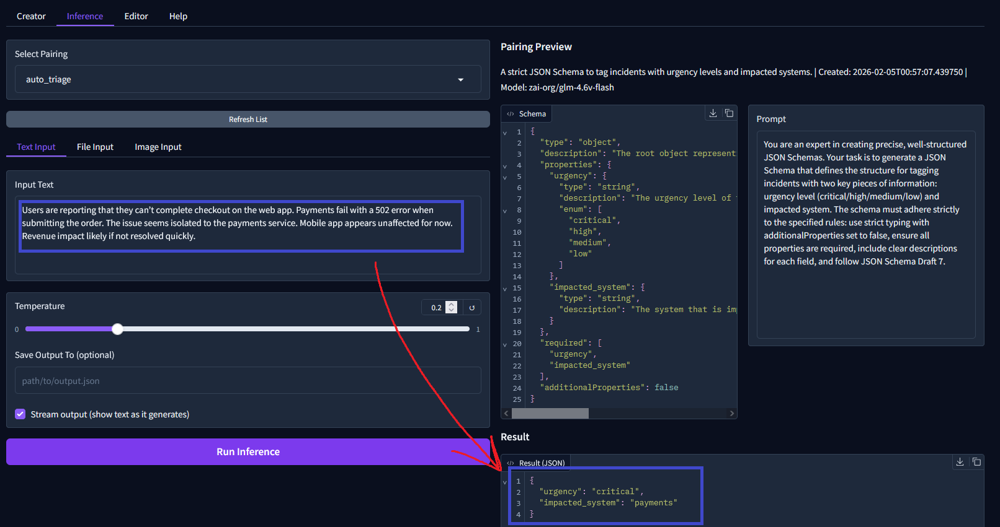
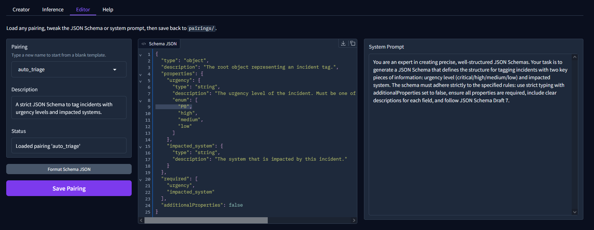

<div align="center">
  <h1 style="font-size:3.2em; letter-spacing:0.05em; font-weight:700;">
    <span style="color:#7C3AED;">{</span>Jig<span style="color:#7C3AED;">}</span>
  </h1>
  <p>Structured output pairings for local + multimodal LLMs (<a href="https://lmstudio.ai/">LM Studio</a> · <a href="https://ollama.com/">Ollama</a>)</p>
  <p>
    <a href="https://github.com/Leodotpy/jig/releases"></a>
    <a href="https://github.com/Leodotpy/jig/stargazers"></a>
    <a href="https://www.python.org/downloads/"></a>
    <a href="LICENSE"></a>
    
  </p>

  <p>
    <a href="#-quick-start"><kbd>🚀 Quick Start</kbd></a>
    <a href="#-workflow-in-detail"><kbd>🧭 Workflow</kbd></a>
    <a href="#-example-incidenturgency-triage-in-jig"><kbd>🖼️ Example</kbd></a>
    <a href="#-contributing"><kbd>🤝 Contribute</kbd></a>
  </p>
</div>

> **Jig** turns natural-language briefs into JSON Schema + system prompt pairings, then runs deterministic inference against your local models. It highlights the multimodal [`zai-org/GLM-4.6`](https://huggingface.co/zai-org/GLM-4.6) checkpoint while remaining compatible with every model you can host in [LM Studio](https://lmstudio.ai/) or [Ollama](https://ollama.com/) (Llama, DeepSeek, Mistral, etc.).

Jig exists for **repeatable LLM inference**: it first co-designs the schema and system prompt you need, then guarantees that every future run follows that contract—perfect for production ETL, reporting, or any workflow where ad-hoc prompts are too brittle.

---

<details open>
<summary><strong>📑 Table of Contents</strong></summary>

- [📢 News](#-news)
- [✨ Highlights](#-highlights)
- [🖼️ Example: Incident/Urgency Triage in Jig](#-example-incidenturgency-triage-in-jig)
- [🚀 Quick Start](#-quick-start)
- [🧭 Workflow in Detail](#-workflow-in-detail)
- [🧠 Local Model Matrix](#-local-model-matrix)
- [📁 Pairings Layout](#-pairings-layout)
- [🛠️ CLI Reference](#-cli-reference)
- [🤝 Contributing](#-contributing)
- [🔐 Security](#-security)
- [📄 License](#-license)

</details>
 
## 📢 News

- **2026-02-05** – Added new CLI/Docs, inline pairing previews, and the manual editor tab.
- **2026-02-04** – Inference tab now previews the selected pairing (schema + prompt).

---

## ✨ Highlights

- **Pairing lifecycle** – Author schemas with the Creator, preview/test them in Inference, then fine-tune every field inside the Editor.
- **Recommended model** – Pull `zai-org/GLM-4.6` once in Ollama/LM Studio for a single text+vision checkpoint; swap to Llama 3, DeepSeek-VL, Phi, etc. whenever you like.
- **Structured enforcement** – JSON Schema (Draft 7) is applied via LM Studio's `response_format` or Ollama's `format`, so outputs never drift.
- **Vision ready** – Drag/drop multiple images into the Image tab; Jig handles base64 plumbing for GLM-4.6, Llava, Moondream, DeepSeek-VL, and friends.
- **Local-first** – No cloud calls. Everything happens against your LM Studio or Ollama runtime.

<div align="center">

| Without Jig | With Jig |
|-------------|----------|
| Prompt drift across runs | Schema-locked outputs |
| Hand-written parsing logic | Auto validation + JSON Schema | 
| No visibility into changes | Versioned pairings on disk |

</div>

---

## 🖼️ Example: Incident/Urgency Triage in Jig

This walkthrough shows how the three Gradio tabs work together to build and run a real pairing.

### Purpose
“Tag incidents with urgency (critical/high/medium/low) and impacted system so on-call engineers can instantly see what needs attention and where.”

### Step 1 — Creator Tab
Describe the task in plain English and Jig generates the schema + system prompt.

```
jig create "Tag incidents with urgency (critical/high/medium/low) and list the impacted system" -n auto_triage
```

<p align="center">
  
</p>

**Generated schema (`auto_triage/schema.json`):**
```json
{
  "type": "object",
  "description": "The root object representing an incident tag.",
  "properties": {
    "urgency": {
      "type": "string",
      "description": "The urgency level of the incident. Must be one of 'critical', 'high', 'medium', or 'low'.",
      "enum": ["critical", "high", "medium", "low"]
    },
    "impacted_system": {
      "type": "string",
      "description": "The system that is impacted by this incident."
    }
  },
  "required": ["urgency", "impacted_system"],
  "additionalProperties": false
}
```

**Generated system prompt (`auto_triage/prompt.txt`):**
> You are an expert in creating precise, well-structured JSON Schemas. Your task is to generate a JSON Schema that defines the structure for tagging incidents with two key pieces of information: urgency level (critical/high/medium/low) and impacted system. The schema must adhere strictly to the specified rules: use strict typing with additionalProperties set to false, ensure all properties are required, include clear descriptions for each field, and follow JSON Schema Draft 7.

### Step 2 — Inference Tab
Select any pairing, review the schema/prompt preview on the right, and run deterministic inference with text, files, or images.

```
jig run -s auto_triage -i "Users are reporting that they can’t complete checkout on the web app. Payments fail with a 502 error when submitting the order. The issue seems isolated to the payments service. Mobile app appears unaffected for now. Revenue impact likely if not resolved quickly."
```

<p align="center">
  
</p>

**Output**
```json
{
  "urgency": "critical",
  "impacted_system": "payments"
}
```

### Step 3 — Editor Tab
Manually tweak schemas or prompts, reformat JSON, and save the pairing—all without leaving the UI.

<p align="center">
  
</p>

### Bonus — Use the pairing from Python
```python
from jig import SchemaAgent, create_client

client = create_client(backend="lmstudio")  # or backend="ollama"
agent = SchemaAgent(client)

incident = (
    "Users report checkout failures (502 errors) on the web app. "
    "Payments service is impacted; mobile unaffected. Revenue at risk."
)

result = agent.run(incident, "auto_triage")
print(result)
```


---

## 🚀 Quick Start

Follow this step-by-step guide to go from idea to deterministic outputs in a few minutes.

### Step 1 — Install Jig and extras

```bash
git clone https://github.com/Leodotpy/jig.git
cd jig
pip install -e .
# Optional UI extras
pip install -e ".[gradio]"
```

### Step 2 — Ready your runtime

| Runtime | What to do |
|---------|------------|
| **[LM Studio](https://lmstudio.ai/)** | Load `zai-org/GLM-4.6` (or any other model), enable the local server under the Developer tab (default port **1234**). |
| **[Ollama](https://ollama.com/)** | `ollama serve` → `ollama pull zai-org/GLM-4.6` (multi-modal). Still works with `llama3`, `deepseek:*`, etc. Default port **11434/11435**. |

> [!TIP]
> If LM Studio isn't running, `--backend auto` will transparently fall back to Ollama.

### Step 3 — Create a pairing

Use natural language to tell Jig what you want; it will craft the system prompt + JSON Schema pairing for repeatable runs.

```bash
jig create "Extract meeting details: attendees, decisions, follow-ups" -n meeting
```

### Step 4 — Run deterministic inference

Feed the model any text (and optional images/files); Jig enforces the schema it generated.

```bash
jig run -s meeting -i "Meeting on Feb 3: Alice assigned budget analysis." -o result.json
```

### Step 5 — Launch the Gradio UI (optional)

```bash
jig --gradio
```

- **Creator tab** – Generate fresh pairings from a plain-English brief.
- **Inference tab** – Preview schema & prompt before you hit "Run Inference" (text/file/image inputs supported).
- **Editor tab** – Pick any pairing (or type a new name) and hand-edit schema + prompt with live validation.

---

## 🧭 Workflow in Detail

1. **Creator**
   - Describe the task → Jig returns `response_schema`, `system_prompt`, and metadata stored under `pairings/<name>/`.
   - Force overwrite with the checkbox, or let auto backups protect existing work.
2. **Inference**
   - Select a pairing; the right rail mirrors its JSON Schema & prompt so you can sanity check before execution.
   - Mix modalities: text area, `.txt` upload, and multi-image gallery all funnel into the same run.
   - Stream results or save directly to disk.
3. **Editor**
   - Dropdown (with custom values) lets you load any pairing or start blank.
   - Schema formatter button pretty-prints + validates JSON before saving.
   - Saving writes `schema.json`, `prompt.txt`, and updates `meta.json` descriptions instantly.

---

## 🧠 Local Model Matrix

| Capability | Suggested model | Notes |
|------------|-----------------|-------|
| Text + Vision (default) | `zai-org/GLM-4.6` | Single checkpoint handles both modalities; works in LM Studio and Ollama. |
| Text-only | `llama3`, `deepseek-r1`, `phi-4`, etc. | Use when you only need deterministic text extraction. |
| Vision-focused | `deepseek-vl`, `llava`, `moondream` | Great for OCR, UI parsing, etc. Images upload via Gradio Image tab or CLI `--image`. |

Jig targets the OpenAI-compatible (LM Studio) or Ollama-native APIs, so any local model that those runtimes expose is fair game.

---

## 📁 Pairings Layout

```
pairings/
├── meeting/
│   ├── schema.json   # JSON Schema enforced at inference time
│   ├── prompt.txt    # System prompt / instructions
│   └── meta.json     # Description, model provenance, timestamps
├── invoice/
│   └── ...
```

Manual edits? Use the Editor tab or edit these files directly—Jig will pick them up instantly. Overwrites create timestamped backups (`*_backup_YYYYMMDD_HHMMSS`).

---

## 🛠️ CLI Reference

| Command | Purpose |
|---------|---------|
| `jig create ...` | Turn a natural-language description into a pairing. |
| `jig run ...` | Execute inference with text / file / `--image` inputs. |
| `jig list` | Show all pairings with completion status. |
| `jig show <name>` | Print schema + prompt contents in the terminal. |
| `jig models [--set <name>]` | List models discovered via the current backend or change the active one. |
| `jig --gradio` | Launch the Gradio UI (Creator · Inference · Editor). |

Common flags: `--backend lmstudio|ollama|auto`, `--model <id>`, `--temperature`, `--image path`, `--output result.json`.

---

## 🤝 Contributing

We welcome improvements in the classic GitHub workflow:

1. **Fork & clone** this repository.
2. **Create a feature branch** (`git checkout -b feat/my-change`).
3. **Install dev extras**: `pip install -e ".[dev]"`.
4. **Format with [Black](https://github.com/psf/black)**: run `black .` (VS Code users can enable “Format on Save” with Black).
5. **Lint & test**: `ruff check .` and `pytest`.
6. **Open a pull request** describing the change and referencing any issues.

Bug reports or feature suggestions via GitHub Issues are equally appreciated.

### Roadmap ideas
- [ ] Multi-step agent workflows that chain multiple pairings.
- [ ] Support for audio-capable LLMs.

---

## 🔐 Security

See [SECURITY.md](SECURITY.md) for coordinated disclosure guidelines.

---

## 📄 License

MIT – see [LICENSE](LICENSE).

<div align="center">

[](https://star-history.com/#Leodotpy/jig&Date)

</div>
